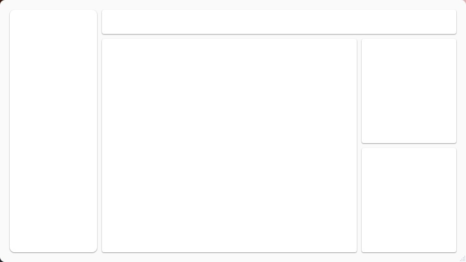

# MEEAT
MEEAT é um aplicativo desenvolvido para encomendas de comidas rápidas (Fast Food)
# Estrutura do Aplicativo 

# Desenvolvedores
- **[Emanuel dos Santos](https://github.com/SW-Wanted)
** - Fundador do Projeto
